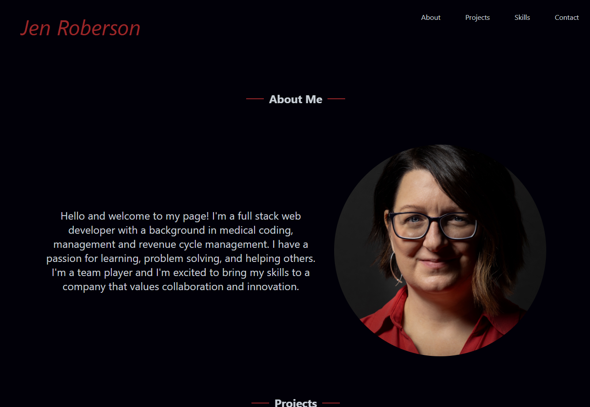
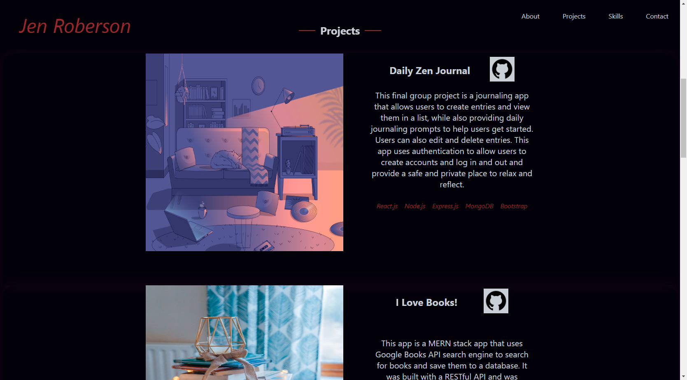

# Portfolio

## Description

This is a portfolio created with React and Animate.css. It contains About, Projects, Skills and Contact sections. Please contact me with questions or comments! 

## Table of Contents

* [Installation](#installation)
* [Usage](#usage)
* [License](#license)
* [Screenshot](#screenshot)
* [Link to deployed application](#link-to-deployed-application)

## Installation

To install this application, clone the code into your terminal. Install the dependencies by running `npm install` in your terminal. Then run `npm start` to start the application.

## Usage

This app is used to create a portfolio.

## License

## Screenshot

## Link to deployed application

https://jrob02180.github.io/portfolio/